<!-- Animated header with Dark → Burgundy gradient -->

  

  
  

  <!-- Animated text -->
  

   

  
  
  
  
  

 

  <table>
    <tr>
      <td width="760" align="center">
         
        <i>"As an Information Technology Engineering student, my goal is to build today the software I will use tomorrow. I am a developer in training who enjoys experimenting with new tools, breaking things in development environments, and building clean code that scales."</i>
          
      </td>
    </tr>
  </table>

<!-- Visual divider -->

<h2 id="about-me" align="center">✦ About Me ✦</h2>

<table align="center">
  <tr>
    <td width="34%" align="center" valign="middle">
      
    </td>
    <td width="66%" align="center" valign="middle">
      <h3>🎓 Education</h3>
      

      <h3>💡 Interests</h3>
      

        
        
        
      

      <h3>🚀 Currently Learning</h3>
      

        
        
      

      <h3>🎯 Goals</h3>
      

    </td>
  </tr>
</table>

 

<h2 id="achievements" align="center">✦ Achievements ✦</h2>

  

 

<h2 id="technologies-and-tools" align="center">✦ Technologies and Tools ✦</h2>

  
<strong>Main Frameworks and Technologies</strong>

  
  
  
  
  
  

    

  
<strong>Tools, Databases, and Environments</strong>

  
  
  
  
  
  
  
  
  
  

    

  
  
  
  
  
  

 

<h2 id="stats-and-activity" align="center">✦ Stats and Activity ✦</h2>

  
  

    

  
  

    

  <picture>
    <source media="(prefers-color-scheme: light)" srcset="https://streak-stats.demolab.com/?user=Elihuangsddf&background=FFFFFF&border=800020&ring=800020&fire=D4AF37&currStreakLabel=800020&sideLabels=24292F&currStreakNum=24292F&sideNums=24292F&dates=57606A" />
    
  </picture>

 

<h2 id="contact" align="center">✦ Contact ✦</h2>

  
  

    

  

